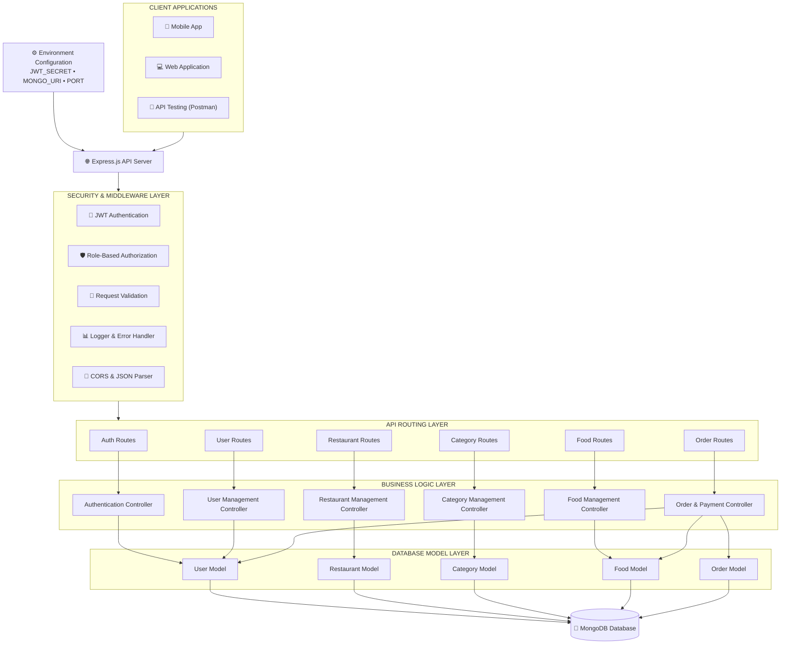

# 🍔 Restaurant Food Delivery Backend API

A scalable and modular food delivery backend built with **Node.js**, **Express.js**, **MongoDB**, and **Mongoose** following a clean layered architecture.

---

# 🚀 Tech Stack

- Node.js
- Express.js
- MongoDB
- Mongoose
- JWT Authentication
- REST API
- bcryptjs
- Morgan Logger
- dotenv

---

# 📁 Project Architecture

